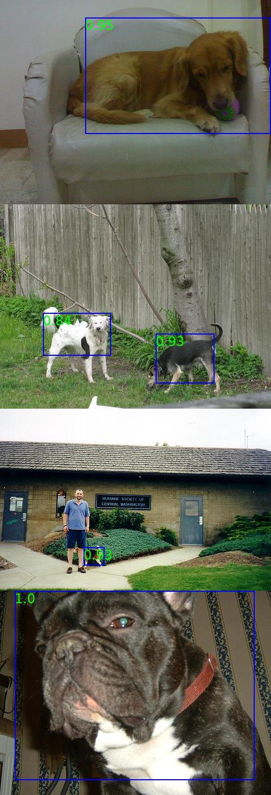

## Introduction
cls2det is an object detection tool based on PyTorch. Unlike most popular object detection algorithms, cls2det implement object detection with only a classifier pre-trained on ImageNet dataset.

## Benchmark
Evaluation on class "dog" on PASCAL VOC 2012 dataset:

|       | AP<sub>50</sub> | AP<sub>40</sub> | AP<sub>30</sub> |
| ----- | --------- | --------- | --------- |
| train | 0.229     | 0.367     | 0.507     |
| val   | 0.235     | 0.382     | 0.510     |

|       | AR<sub>50</sub> | AR<sub>40</sub> | AR<sub>30</sub> |
| ----- | --------- | --------- | --------- |
| train | 0.406     | 0.426     | 0.636     |
| val   | 0.394     | 0.533     | 0.631     |

- Achieve good visual results by only using a classifier without any training process
- Although the metrics are not good as SOTA, the location of the bounding box prediction is highly correlated with the ground truth from the perspective of the intuitive feeling. In some cases, e.g. when the size of the bounding box prediction does not need to be very accurate, this tool is very meaningful.



### Requirements

- Linux
- Python 3.6+
- PyTorch 1.1.0 or higher
- CUDA 9.0 or higher

### Install

a. Create a conda virtual environment and activate it.

```shell
conda create -n cls2det python=3.6 -y
conda activate cls2det
```

b. Install PyTorch and torchvision following the [official instructions](https://pytorch.org/),
 *e.g.*,

```shell
conda install pytorch torchvision -c pytorch
```

c. Clone the cls2det repository.

```shell
git clone https://github.com/Media-Smart/cls2det.git
cd cls2det
```

d. Install dependencies.

```shell
pip install -r requirements.txt
```

## Prepare data

Download [Pascal VOC 2012](http://host.robots.ox.ac.uk/pascal/VOC/voc2012/VOCtrainval_11-May-2012.tar)  and put the dataset into `cls2det/data` directory, the structure of data directory will look like as follows: 

```shell
  data
    ├── VOC2012
    │     ├── Annotations
    │     ├── ImageSets
    │     │       └──── main
    │     └── JPEGImages
    ├── eval
    ├── result
    └── imagenet.txt
```

## Demo
a. Config

Modify some configuration accordingly in the config file like `configs/detection.py`

b. Run

```shell
python tools/demo.py --img_path <path to image>
```

Rendered image with bounding box prediction and confidence will be stored in `data/result`.

## Eval

a. Config

Modify some configuration accordingly in the config file like `configs/detection.py`

b. Run

```shell
python tools/eval.py 
```
The evaluation report will be shown on terminal.

